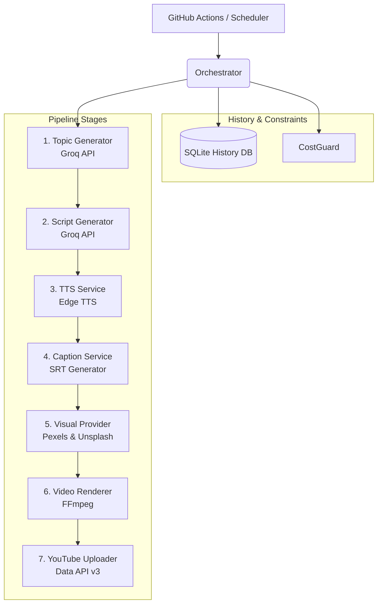

# AutoShorts 

AutoShorts AI is a fully automated, zero cost YouTube Shorts generation pipeline. It autonomously comes up with unique topics, writes engaging scripts, synthesizes human sounding narration, curates stock background visuals, edits them together with captions, and uploads the final video to YouTube all entirely hands free.

## Features
- **Brainstorming & Scripting:** Utilizes Groq for lightning fast, highly engaging script generation.
- **Text-to-Speech:** Uses Microsoft Edge TTS for unlimited, free voice narration.
- **Visual Curation:** Automatically fetches relevant stock videos and images from Pexels and Unsplash.
- **Dynamic Captions & Rendering:** Programmatically generates SRT captions and renders 1080x1920 vertical videos via FFmpeg.
- **Zero-Cost Architecture:** Designed explicitly to operate safely within the free tier limits of all third party APIs .
- **Fully Automated:** Managed by GitHub Actions for completely hands off scheduling and uploading via the YouTube Data API v3.

---

## Architecture & Pipeline Flow

The system is built around a central `Orchestrator` that sequentially manages various domain driven services.



### Detailed Component Breakdown

1. **History Backend (SQLite):** Before generating a topic, the orchestrator queries `autoshorts_history.db` to retrieve recent topics. This ensures the channel never repeats the same video concept.
2. **Topic & Script Generation (Groq):** Powered by the lightning fast Groq API, the pipeline first generates a single, high engagement topic. It then generates a fast paced, multi segment JSON script designed for viewer retention.
3. **TTS Service (Edge TTS):** Each script segment is independently synthesized into audio using Microsoft Edge's hidden TTS API. This avoids expensive AI voice generation fees.
4. **Caption Generation:** The duration of each generated audio segment is precisely measured. The system then builds an `.srt` subtitle file mapping the script text perfectly to the audio timing.
5. **Visual Provider:** Uses the video topic to search Pexels for vertical stock video. If Pexels lacks sufficient footage, it gracefully cascades to Unsplash for stock images. **Local Fallback:** If API quotas are hit or network connections fail, a local animated background (`assets/video/fallback.mp4`) is looped to ensure the video always renders successfully.
6. **Video Renderer (FFmpeg):** The heavy lifter. It takes the stitched audio, the downloaded visual assets (scaling/cropping them to 1080x1920), burns in the SRT captions, and outputs the final `final_short.mp4`.
7. **YouTube Uploader:** Authenticates via a `youtube_credentials.json` OAuth token and uploads the video using the YouTube Data API v3. 

---
## Local Setup & Usage

### 1. Environment Variables
Copy `.env.example` to `.env` and fill in your free tier API keys:
```bash
GROQ_API_KEY=your_key
PEXELS_API_KEY=your_key
UNSPLASH_API_KEY=your_key
```

### 2. YouTube Authentication
To authorize uploads to your channel, you must first generate a `client_secrets.json` file from Google Cloud Console. Then, run the local auth script to generate your refresh token:
```bash
python scripts/youtube_auth.py
```

### 3. Run the Pipeline
To run a single generation cycle locally without uploading:
```bash
python scripts/run_short.py --no-upload
```

To run a dry run (tests database connectivity without hitting APIs):
```bash
python scripts/run_short.py --dry-run
```

### 4. Regenerate Local Fallback Visual
If you want to customize or regenerate the emergency animated background visual:
```bash
python scripts/generate_fallback.py
```
